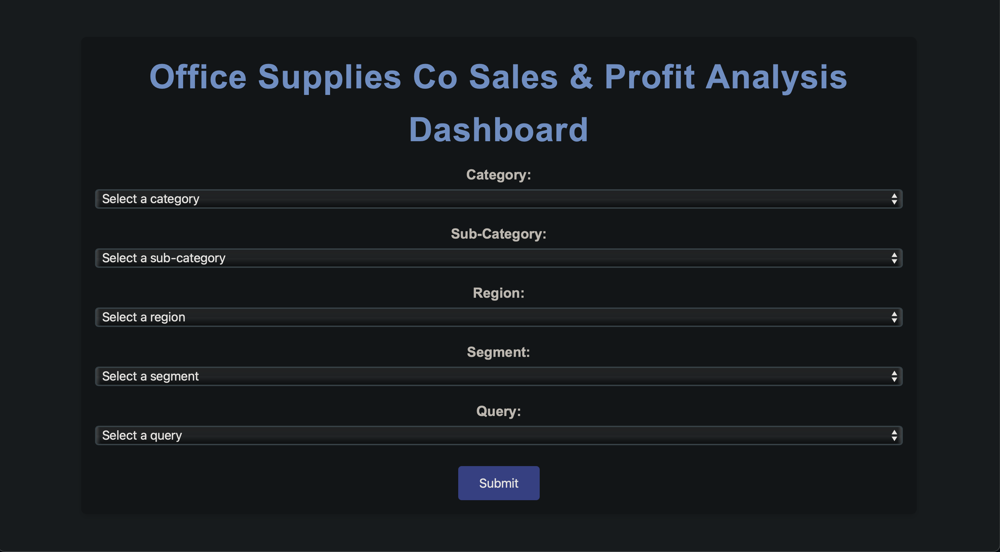

# **Flask Query Application**

This project is a Flask-based web application designed to analyze sales data from the **`TableauSalesData.csv`** file. It allows users to perform queries on the dataset and provides quick, easy-to-understand insights into the office supply company's business performance.

---

## **Features**

- **Total Sales and Profit**: Analyze overall revenue and profitability.
- **Average Discount by Product**: Identify discount patterns across products.
- **Total Sales by Year**: Track yearly sales trends.
- **Profit by Region**: Understand which regions perform the best.
- **Products with Negative Profit**: Highlight products that need attention.

## **Prerequisites**

- Python 3.8 or higher
- Flask
- A suitable IDE (e.g., PyCharm, VS Code)
---
## **Setup Instructions:**

## **1. Clone Repository using Pycharm:**
- Using PyCharm: Navigate to "Clone Repository" then paste the URL, and clone the repository.
```bash
https://github.com/Hoffman3/Flask-Office-Supply-Data.git
```

## **2. Clone the Repository using terminal:**
locate the terminal on your IDE and copy and paste the following then add files to main project directory
```bash
git clone https://github.com/Hoffman3/Flask-Office-Supply-Data.git
```
## **3. Create and activate virtual environment:**
```bash
python -m venv venv
```
Windows:
```
venv\Scripts\activate
```
MacOS
```
source venv/bin/activate
```

## **3. Install dependencies with the command below:**
```bash
pip install -r requirements.txt
```
## **4. Start the Flask application by running:**

```bash
python app.py

```
Or by using pycharm or your specific IDE navigate to the start button at the top or bottom right
## **5. Navigate to the pre development website:**
You should see an output with the pre development server below (this website is only available to you after running the application):

```
http://127.0.0.1:5000
```


